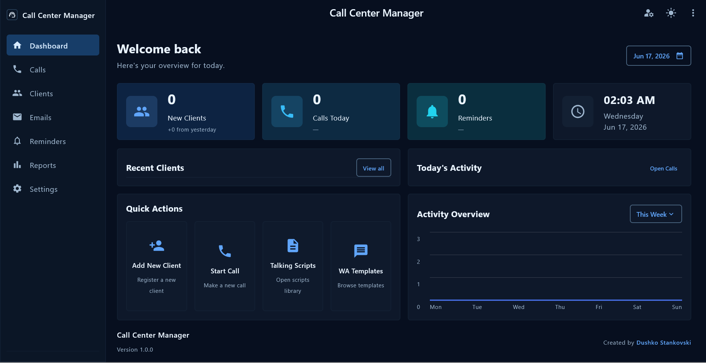

# Call Center Manager - PC Version

Call Center Manager PC is a Windows desktop version of the Call Center Manager application. It is designed for local call center work, client management, call tracking, reminders, scripts, WhatsApp templates, and reporting.

## Main Features

- Client management with name, phone, email, company, address, notes, status, priority, and reminder date.
- Call history and contact logs for every client.
- Email and WhatsApp contact actions.
- Talking scripts and WhatsApp templates.
- Dashboard with daily overview, recent clients, quick actions, reminders, and activity overview.
- Light and dark theme.
- Local desktop database.
- Local PC user login system.

## PC Login System

The PC version uses only local username and password accounts.

There is no Firebase login, Google login, or online profile connection in the PC version.

Login is optional:

- If no local users are created, the application opens without asking for username and password.
- If an administrator creates local users, the application asks for username and password when it starts.
- Usernames are not case-sensitive.
- Passwords are case-sensitive.
- Administrator users can create or remove local users.
- Administrator users can disable local login if they no longer want the app to ask for username and password.

## First Administrator

When local login is not configured, open the app and go to Settings.

From there, create the first administrator account.

After an administrator is created, the app will require login on startup.

## Disable Login

To disable username and password login:

1. Login as an administrator.
2. Open Settings.
3. Use the option to disable local login.
4. After that, the app will open without asking for username and password.

## Installation

The Windows installer is built as an MSI file.

